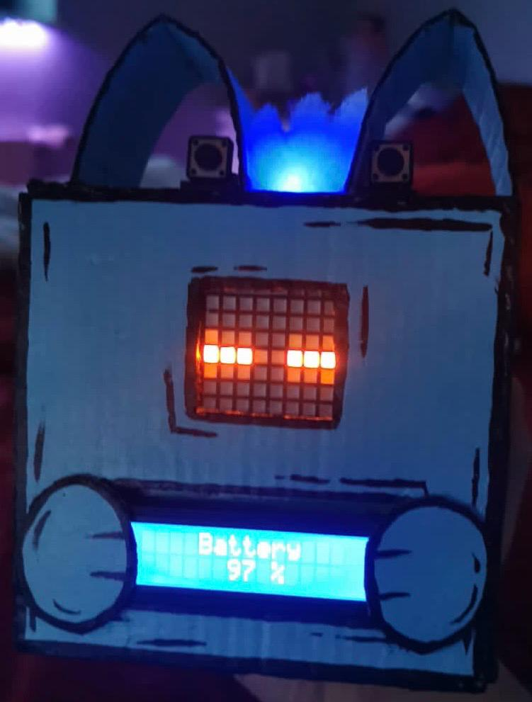
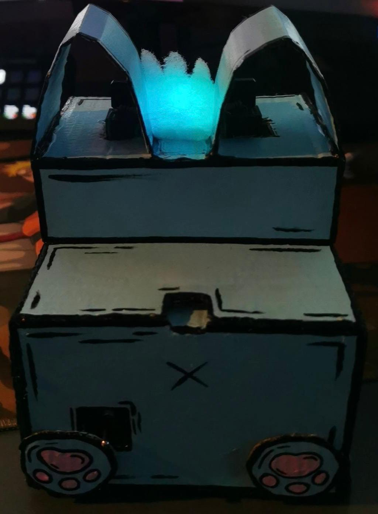

# Felix Bot


## Overview

**Felix Bot** is a project developed as part of the "Eingebettete Systeme" module. The project leverages the ESP32 microcontroller to create a versatile and interactive bot that can monitor environmental conditions, display information, and interact with users through various sensors and outputs.

## Features

- **Temperature Measurement:** Equipped with a sensor to monitor ambient temperature.
- **LED Indicator:** Visual feedback using LEDs.
- **LCD Display:** Displays real-time information, such as temperature readings.
- **LCD Matrix:** Shows custom faces and animations.
- **Sensors:** Includes various sensors for detecting environmental parameters.
- **3D Printed Case:** The bot is encased in a custom-designed 3D printed shell for protection and aesthetics.
- **Rechargeable Battery:** Powered by a rechargeable battery, allowing for portable operation.

## Components Used

- **ESP32 Microcontroller:** The brain of the Felix Bot, handling all processing and communication tasks.
- **Temperature Sensor:** For accurate environmental monitoring.
- **LEDs:** For visual indications and alerts.
- **LCD Display:** A small screen for displaying data.
- **LCD Matrix:** An array of LEDs used for creating dynamic visuals.
- **Sensors:** Various sensors (e.g., humidity, proximity) to interact with the environment.
- **3D Printed Case:** Designed to house all components securely.
- **Rechargeable Battery:** Allows the bot to operate without being tethered to a power source.

## Setup and Usage

1. **Assembly:** Assemble the Felix Bot by fitting all components into the 3D printed case.
2. **Powering Up:** Charge the battery using the provided charging circuit.
3. **Programming:** Upload the provided code to the ESP32 using the Arduino IDE or PlatformIO.
4. **Operation:** Once powered on, the bot will begin measuring temperature, displaying data on the LCD screen, and interacting with the environment through its sensors and LEDs.

## Installation

1. Clone this repository:
    ```sh
    git clone https://github.com/yourusername/felix-bot.git
    ```
2. Navigate to the project directory and open the code in your preferred IDE.
3. Connect your ESP32 and upload the code.
